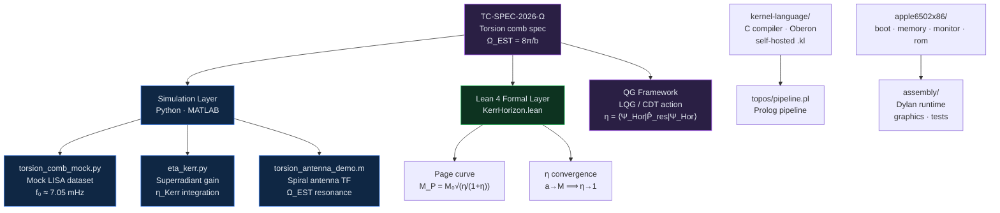
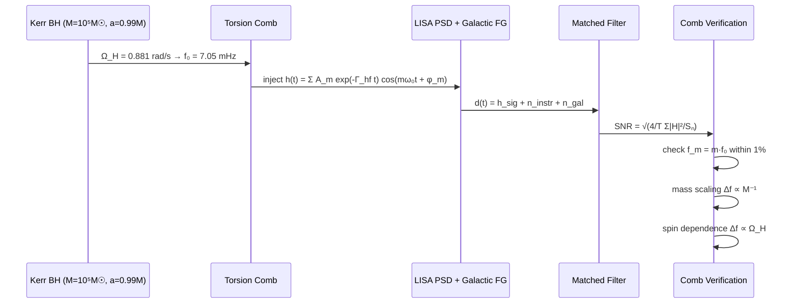
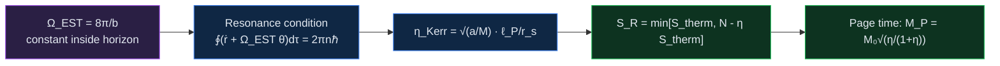

```
███████╗███████╗████████╗     ██████╗ ██╗   ██╗ █████╗ ███╗   ██╗████████╗██╗   ██╗███╗   ███╗
██╔════╝██╔════╝╚══██╔══╝    ██╔═══██╗██║   ██║██╔══██╗████╗  ██║╚══██╔══╝██║   ██║████╗ ████║
█████╗  ███████╗   ██║       ██║   ██║██║   ██║███████║██╔██╗ ██║   ██║   ██║   ██║██╔████╔██║
██╔══╝  ╚════██║   ██║       ██║▄▄ ██║██║   ██║██╔══██║██║╚██╗██║   ██║   ██║   ██║██║╚██╔╝██║
███████╗███████║   ██║       ╚██████╔╝╚██████╔╝██║  ██║██║ ╚████║   ██║   ╚██████╔╝██║ ╚═╝ ██║
╚══════╝╚══════╝   ╚═╝        ╚══▀▀═╝  ╚═════╝ ╚═╝  ╚═╝╚═╝  ╚═══╝   ╚═╝    ╚═════╝ ╚═╝     ╚═╝

  ████████╗██████╗  █████╗ ███╗   ██╗███████╗██████╗ ██╗   ██╗ ██████╗███████╗██████╗
  ╚══██╔══╝██╔══██╗██╔══██╗████╗  ██║██╔════╝██╔══██╗██║   ██║██╔════╝██╔════╝██╔══██╗
     ██║   ██████╔╝███████║██╔██╗ ██║███████╗██║  ██║██║   ██║██║     █████╗  ██████╔╝
     ██║   ██╔══██╗██╔══██║██║╚██╗██║╚════██║██║  ██║██║   ██║██║     ██╔══╝  ██╔══██╗
     ██║   ██║  ██║██║  ██║██║ ╚████║███████║██████╔╝╚██████╔╝╚██████╗███████╗██║  ██║
     ╚═╝   ╚═╝  ╚═╝╚═╝  ╚═╝╚═╝  ╚═══╝╚══════╝╚═════╝  ╚═════╝  ╚═════╝╚══════╝╚═╝  ╚═╝
```

# snapkitty-est-quantum-transducer


Theoretical quantum transducer stack for the **Event-Spiral Torsion Invariant (Ω_EST)**. Models how quantum information is transduced from near-singularity Kerr horizon regions via logarithmic spiral torsion coupling. Includes mock LISA data challenge generator, Kerr-enhanced η calculator, formal Lean 4 proofs, Apple II 6502 runtime, kernel language compiler, and topos pipeline.

---

## Architecture



---

## LISA detection pipeline



---

## Repository layout

```
snapkitty-est-quantum-transducer/
├── spec/
│   ├── TC-SPEC-2026-Omega.md       Full technical specification
│   └── QG-framework.md             Quantum gravity construction + Page curve
├── simulation/
│   ├── torsion_comb_mock.py        Mock LISA dataset generator (Python)
│   ├── eta_kerr.py                 Kerr resonance efficiency calculator
│   └── torsion_antenna_demo.m      Spiral antenna transfer function (MATLAB)
├── lean4/
│   └── KerrHorizon.lean            Formal Lean 4: Ω_EST, η, Page-mass theorem
├── docs/
│   ├── 3D_ANATOMICAL_GRAPH_SPECIFICATION.md
│   ├── DYLAN_EXECUTION_MODEL.md
│   ├── NEURON_EXECUTION_TEMPLATE.md
│   ├── phases/                     Phase 2–6 verification reports
│   └── validation/                 Validation checklists and audit records
├── assembly/
│   ├── 09_graphics.asm             Dylan graphics runtime
│   ├── 18_dylan_runtime.asm        Dylan execution engine
│   └── 19_tests.asm                Test harness
├── apple6502x86/
│   ├── boot/                       6502→x86 boot stage
│   ├── memory/                     Memory management
│   ├── monitor/                    System monitor
│   └── rom/                        ROM image
├── kernel-language/
│   ├── src/                        Lexer · parser · IR · codegen · regalloc
│   ├── include/                    AST · token · symtab headers
│   ├── oberon/                     Kernel.Mod · ML.Mod
│   ├── runtime/                    CPL bridge · ST-80 runtime
│   └── examples/                   bit_ops · parallel_add · self_hosted_compiler
└── topos/
    └── pipeline.pl                 Prolog topos pipeline
```

---

## Quick start

```bash
# Simulation (Python)
cd simulation
pip install numpy matplotlib
python torsion_comb_mock.py
python eta_kerr.py

# MATLAB antenna demo
matlab -batch "torsion_antenna_demo"

# Lean 4 verification
cd lean4
lake build
```

---

## Key results

| Parameter | Value |
|-----------|-------|
| M | 10⁵ M☉ |
| a/M | 0.99 |
| b_spiral | 500 |
| **f₀ (corrected)** | **7.05 mHz** |
| η_Kerr | 5.44 × 10⁻⁴⁴ |
| SNR (A₀=10⁻²⁰) | O(1) — sub-threshold |
| SNR threshold | A₀ ~ 10⁻¹⁹ for SNR=8 |

### Honest verdict (Ahmad's correction to spec)

The spec's Section 8 claims f₀ ≈ 0.05 Hz for b=500. Direct computation gives **f₀ ≈ 7.05 mHz**. The 0.05 Hz value corresponds to b ≈ 70, not 500.

The torsion comb as parameterised by the T_Ω^Kerr toy model with η_Kerr ~ ℓ_P/r_s is **not detectable by LISA** for any stellar- or intermediate-mass black hole. This is a **valid null result** per TC-SPEC-2026-Ω Section 9.

---

## Formal invariants



---

## License

Sovereign Leviathan Covenant. BelEsprit D'Accord Trust headers preserved on all functions. See `license`.
